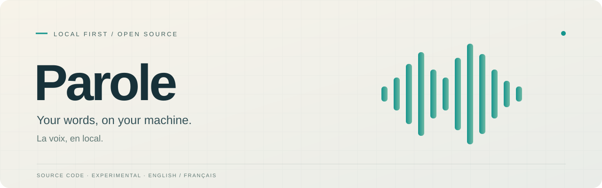

# Parole

[English](README.md) · [Français](README.fr.md)

**D'un enregistrement à un document que l'on peut examiner.** Parole est une application de bureau à traitement local pour transcrire des fichiers audio et vidéo, distinguer les voix, traduire facultativement les paroles et rédiger un compte rendu accompagné de passages sources. Son lecteur réunit l'enregistrement, la transcription horodatée et les réglages de présentation. Le traitement repose sur des moteurs locaux, sans service d'inférence distant.

> **Publication des sources, expérimentale.** Ce dépôt fournit du code aux personnes qui contribuent, pas un installateur public officiel. L'interface de bureau et les textes de l'installateur sont actuellement en français. La présence de documentation anglaise et française ne signifie ni interface traduite ni version de production prise en charge.

## Ce que contient le dépôt

- Importer un média, le transcrire par passages persistés, distinguer les locuteurs et reprendre les travaux locaux interrompus.
- Lire et écouter les passages horodatés ; régler leur regroupement et leur affichage sans réécrire les segments sources.
- Demander une traduction et un compte rendu fondé sur des citations horodatées. Ce sont des aides à la relecture, non des procès-verbaux vérifiés des paroles ou des décisions.
- Explorer des **pistes de sujets lexicales** préparées explicitement et retrouver leurs passages d'origine. Il ne s'agit pas d'un classement thématique automatique, étalonné pour la production.
- Exporter en TXT, Markdown, DOCX, JSON, SRT ou VTT, sous réserve de l'état du travail et des avertissements de résultat incomplet.

Les ressources de parole, de langue et de séparation des voix sont épinglées dans [`MODEL_MANIFEST.json`](MODEL_MANIFEST.json). Les modèles, les vrais enregistrements et les binaires des moteurs natifs sont **exclus de Git**. La construction des ressources natives et le téléchargement explicite des modèles peuvent nécessiter le réseau ; l'inférence ne bascule pas vers le cloud.

## Partir des sources

1. Lire [BUILD.fr.md](BUILD.fr.md) pour les prérequis de la plateforme, les moteurs natifs, les modèles et la compilation de l'application. Un aperçu du frontend seul n'est pas l'application native de traitement.
2. Consulter [TESTING.fr.md](TESTING.fr.md) pour les vérifications adaptées à votre environnement. Une compilation réussie ne vaut pas validation de l'application installée.
3. Suivre le [guide d'utilisation](docs/usage.fr.md) seulement après préparation des ressources locales nécessaires. Aucun installateur public officiel n'est proposé ici.

Les équivalents anglais sont [BUILD.md](BUILD.md), [TESTING.md](TESTING.md) et le [usage guide](docs/usage.md).

## Documentation

| À lire | Français | English |
| --- | --- | --- |
| Frontières du système et circulation des données | [Architecture](docs/architecture.fr.md) | [Architecture](docs/architecture.md) |
| Préparation des sources et parcours dans l'application | [Utilisation](docs/usage.fr.md) | [Usage](docs/usage.md) |
| Compilation et vérification | [Compilation](BUILD.fr.md) · [Tests](TESTING.fr.md) | [Build](BUILD.md) · [Testing](TESTING.md) |
| Licences et composants tiers | [Licences](LICENSING.fr.md) · [Licences tierces](THIRD_PARTY_LICENSES.fr.md) | [Licensing](LICENSING.md) · [Third-party licenses](THIRD_PARTY_LICENSES.md) |
| Contribuer et signaler une vulnérabilité | [Contribuer](CONTRIBUTING.fr.md) · [Sécurité](SECURITY.fr.md) | [Contributing](CONTRIBUTING.md) · [Security](SECURITY.md) |
| Politique de publication et changements | [Publication](RELEASE.fr.md) · [Historique](CHANGELOG.fr.md) | [Release](RELEASE.md) · [Changelog](CHANGELOG.md) |

## Limites

Ce dépôt n'est ni un jeu de données ni un banc d'essai. Il faut relire la reconnaissance, l'attribution des voix, les traductions et les comptes rendus avant usage ou diffusion. Le fonctionnement installé sous Windows, la validation sur le Mac cible, les réunions longues, l'usage avec 8 Go de RAM et la qualité réelle des traductions et comptes rendus ne constituent pas des garanties générales établies. Voir [RELEASE.fr.md](RELEASE.fr.md) pour les critères de publication, plutôt que de présumer qu'un paquet compilé est validé.

Le code principal est sous licence MIT ; le service optionnel `src-gliclass` est sous Apache-2.0. Les licences des modèles et moteurs sont distinctes : consulter [LICENSING.fr.md](LICENSING.fr.md) et [THIRD_PARTY_LICENSES.fr.md](THIRD_PARTY_LICENSES.fr.md) avant toute distribution d'un paquet. Les contributions suivent [CONTRIBUTING.fr.md](CONTRIBUTING.fr.md) ; pour les vulnérabilités, utiliser le canal privé indiqué dans [SECURITY.fr.md](SECURITY.fr.md), jamais une issue publique contenant des détails sensibles.
